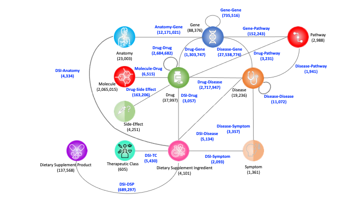

# integrative Biomedical Knowledge Hub (iBKH)
iBKH integrates data from 18 publicly available biomedical databases. The current version of iBKH contains a total of 2,384,501 entities of 11 types. Specifically, the iBKH includes 23,003 anatomy entities, 19,236 disease entities, 37,997 drug entities, 88,376 gene entities, 2,065,015 molecule entities, 1,361 symptom entities, 4,101 DSI entities, 137,568 DSP entities, 605 TC entities, 2,988 pathway entities and 4,251 side-effect entities. For the relationships in the iBKH, there are 86 relation types within 18 kinds of entity pairs, including Anatomy-Gene, Drug-Disease, Drug-Drug, Drug-Gene, Disease-Disease, Disease-Gene, Disease-Symptom, Gene-Gene, DSI-Disease, DSI-Symptom, DSI-Drug, DSI-Anatomy, DSI-DSP, DSI-TC, Disease-Pathway, Drug-Pathway, Gene-Pathway and Drug-Side Effect. In total, iBKH contains 48,194,646 relations.



## Materials and Methods
Our ultimate goal was to build a biomedical knowledge graph via comprehensively incorporating biomedical knowledge as much as possible. To this end, we collected and integrated 18 publicly available data sources to curate a comprehensive one. Details of the used data resources were listed in [Table](Source Information/README.md).

## Statistics of iBKH
| Entity Type    | Number    | Included Identifiers |
| ---------------|:---------:|:--------------------:|
| Anatomy        | 23,003    | Uberon ID, BTO ID, MeSH ID, Cell Ontology ID |
| Disease        | 19,236    | Disease Ontology ID, KEGG ID, PharmGKB ID, MeSH ID, OMIM ID |
| Drug           | 37,997    | DrugBank ID, KEGG ID, PharmGKB ID, MeSH ID |
| Gene           | 88,376    | HGNC ID, NCBI ID, PharmGKB ID |
| Molecule       | 2,065,015 | CHEMBL ID, CHEBI ID |
| Symptom        | 1,361       | MeSH ID |
| Dietary Supplement Ingredient |	4,101	| iDISK ID |
| Dietary Supplement Product |	137,568 |	iDISK ID |
| Therapeutic Class |	605 |	iDISK ID, UMLS CUI |
| Pathway | 2,988 | Reactome ID, KEGG ID, Gene Ontology ID |
| Side-Effect | 4,251 | UMLS CUI |
| **Total Entities** | **2,384,501** | - |

| Relation Type   |	Number     |
| ----------------|:----------:|
| Anatomy-Gene	  | 12,171,021 |
| Drug-Disease	  | 2,717,947  |
| Drug-Drug	      | 2,684,682  |
| Drug-Gene	      | 1,303,747  |
| Disease-Disease	| 11,072     |
| Disease-Gene	  | 27,538,774 |
| Disease-Symptom	| 3,357      |
| Gene-Gene	      | 735,156  |
| DSI-Symptom     |	2,093      |
| DSI-Disease	    | 5,134      |
| DSI-Drug        | 3,057      |
| DSI-Anatomy     |	4,334      |
| DSP-DSI         |	689,297    |
| DSI-TC          |	5,430      |
| Disease-Pathway | 1,941      |
| Drug-Pathway    | 3,231      |
| Gene-Pathway    | 152,243    |
| Drug-Side Effect| 163,206    |
| **Total Relations** | **48,194,646** |

## Licence
The data of CBKG is licensed under the [MIT License](https://github.com/houyurain/CBKH/blob/main/LICENSE). The iBKH integrated the data from many resources, and users should consider the licenses for each of them (see the detail in the [table](https://github.com/houyurain/CBKH/blob/main/Source%20Information/README.md)). 

## Cite
```
@article{su2021cbkh,
  title={CBKH: The Cornell Biomedical Knowledge Hub},
  author={Su, Chang and Hou, Yu and Guo, Winston and Chaudhry, Fayzan and Ghahramani, Gregory and Zhang, Haotan and Wang, Fei},
  journal={medRxiv},
  year={2021},
  publisher={Cold Spring Harbor Laboratory Press}，
  url = {https://www.medrxiv.org/content/10.1101/2021.03.12.21253461v1}
}
```

