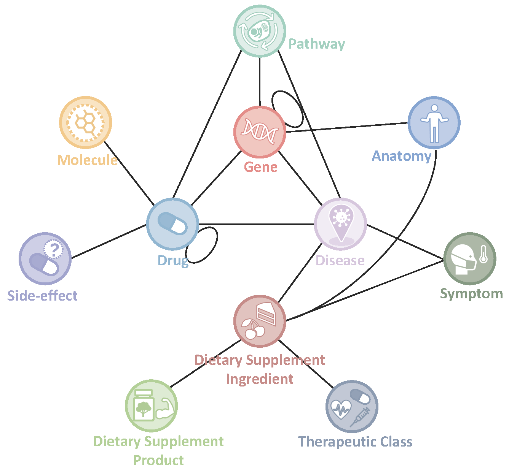

# integrative Biomedical Knowledge Hub (iBKH)
iBKH integrates data from 17 publicly available biomedical databases. The current version of iBKH contains a total of 2,384,501 entities of 11 types. Specifically, the iBKH includes 23,003 anatomy entities, 19,236 disease entities, 37,997 drug entities, 88,376 gene entities, 2,065,015 molecule entities, 1,361 symptom entities, 4,101 DSI entities, 137,568 DSP entities, 605 TC entities, 2,988 pathway entities and 4,251 side-effect entities. For the relationships in the iBKH, there are 86 relation types within 18 kinds of entity pairs, including Anatomy-Gene, Drug-Disease, Drug-Drug, Drug-Gene, Disease-Disease, Disease-Gene, Disease-Symptom, Gene-Gene, DSI-Disease, DSI-Symptom, DSI-Drug, DSI-Anatomy, DSI-DSP, DSI-TC, Disease-Pathway, Drug-Pathway, Gene-Pathway and Drug-Side Effect. In total, iBKH contains 48,194,646 relations.



## Materials and Methods
Our ultimate goal was to build a biomedical knowledge graph via comprehensively incorporating biomedical knowledge as much as possible. To this end, we collected and integrated 17 publicly available data sources to curate a comprehensive one. Details of the used data resources were listed in [Table](https://github.com/wcm-wanglab/iBKH/blob/main/Source%20Information/README.md).

## Statistics of iBKH
| Entity Type    | Number    | Included Identifiers |
| ---------------|:---------:|:--------------------:|
| Anatomy        | 23,003    | Uberon ID, BTO ID, MeSH ID, Cell Ontology ID |
| Disease        | 19,236    | Disease Ontology ID, PharmGKB ID, MeSH ID, OMIM ID |
| Drug           | 37,997    | DrugBank ID, PharmGKB ID, MeSH ID |
| Gene           | 88,376    | HGNC ID, NCBI ID, PharmGKB ID |
| Molecule       | 2,065,015 | CHEMBL ID, CHEBI ID |
| Symptom        | 1,361       | MeSH ID |
| Dietary Supplement Ingredient |	4,101	| iDISK ID |
| Dietary Supplement Product |	137,568 |	iDISK ID |
| Therapeutic Class |	605 |	iDISK ID, UMLS CUI |
| Pathway | 2,988 | Reactome ID, Gene Ontology ID |
| Side-Effect | 4,251 | UMLS CUI |
| **Total Entities** | **2,384,501** | - |

| Relation Type   |	Number     |
| ----------------|:----------:|
| Anatomy-Gene	  | 12,171,021 |
| Drug-Disease	  | 2,717,947  |
| Drug-Drug	      | 2,684,682  |
| Drug-Gene	      | 1,303,747  |
| Disease-Disease	| 11,072     |
| Disease-Gene	  | 27,538,774 |
| Disease-Symptom	| 3,357      |
| Gene-Gene	      | 735,156  |
| DSI-Symptom     |	2,093      |
| DSI-Disease	    | 5,134      |
| DSI-Drug        | 3,057      |
| DSI-Anatomy     |	4,334      |
| DSP-DSI         |	689,297    |
| DSI-TC          |	5,430      |
| Disease-Pathway | 1,941      |
| Drug-Pathway    | 3,231      |
| Gene-Pathway    | 152,243    |
| Drug-Side Effect| 163,206    |
| **Total Relations** | **48,194,646** |

## Neo4j Deployment
We deployed our iBKH using Neo4j (https://neo4j.com) on AWS, a robust graph database platform. Specifically, Neo4j can take the CSV files of entities and relations we curated as input and automatically create a KG instance. In this way, the iBKH can be updated efficiently and flexibly. Follow instructions [here](https://docs.google.com/document/d/1cLDPLp_nVCJ5xrDlJ-B-Q3wf24tb-Dyq55nAXxaNgTM/edit?usp=sharing) to deploy iBKH in your AWS server.

## iBKH-based knowledge discovery
We developed a knowledge discovery pipeline in iBKH. We utilized [Deep Graph Library - Knowledge Graph Embedding (DGL-KE)](https://github.com/awslabs/dgl-ke) to learn embeddings of iBKH, based on which we can derive novel biomedical knowledge. We applied our pipeline for two case studies, Alzheimer's disease drug repurposing hypothesis generation and a knowledge-enhanced EHR patient cohort study. All codes for these analyses can be found [here](https://github.com/wcm-wanglab/iBKH/tree/main/Codes). And please refer to [readme for case studies](https://github.com/wcm-wanglab/iBKH/blob/main/Codes/README.md) for more details.

## Licence
iBKH is licensed under the [Apache-2.0](https://www.apache.org/licenses/LICENSE-2.0) and [CC BY-NC-SA 4.0](https://creativecommons.org/licenses/by-nc-sa/4.0/). The iBKH integrated the data from many resources, and users should consider the licenses for each of them (see the detail in the [table](https://github.com/wcm-wanglab/iBKH/blob/main/Source%20Information/README.md)). For sources with defined licenses, we apply the license attribute on a per-node and per-edge basis. However, some sources do not provide any licenses, so for those, we have requested permission.

## Cite
```
@article {Su2021.03.12.21253461,
  title = {Biomedical Discovery through the integrative Biomedical Knowledge Hub (iBKH)},
  author = {Chang Su, Yu Hou, Suraj Rajendran, Jacqueline R. M. A. Maasch, Zehra Abedi, Haotan Zhang, Zilong Bai, 
	    Anthony Cuturrufo, Winston Guo, Fayzan F. Chaudhry, Gregory Ghahramani, Jian Tang, Feixiong Cheng, 
	    Yue Li, Rui Zhang, Jiang Bian, Fei Wang},
  year = {2022},
  doi = {10.1101/2021.03.12.21253461},
  publisher = {Cold Spring Harbor Laboratory Press},
  URL = {https://www.medrxiv.org/content/10.1101/2021.03.12.21253461v4},
  journal = {medRxiv}
}

```

