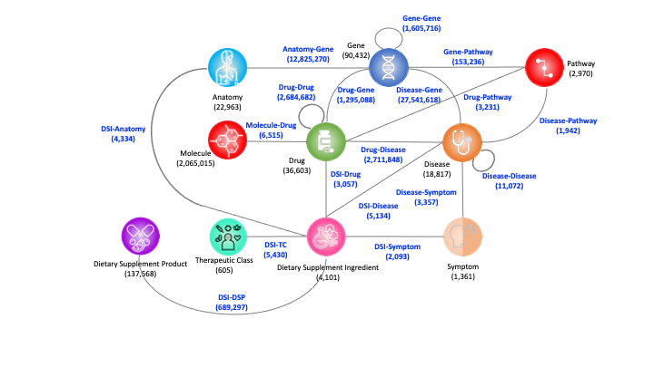

# Comprehensive Biomedical Knowledge Hub (CBKH)
CBKG integrates data from 15 publicly available biomedical databases. The current version of CBKG contains a total of 2,231,297 entities of 6 types. Specifically, the CBKG includes 22,963 anatomy entities, 18,503 disease entities, 36,436 drug entities, 87,942 gene entities, 2,065,015 molecule entities and 438 symptom entities. For the relationships in the CBKG (Table 3), there are 91 relation types within 8 kinds of entity pairs, including Anatomy-Gene, Drug-Disease, Drug-Drug, Drug-Gene, Disease-Disease, Disease-Gene, Disease-Symptom and Gene-Gene. In total, CBKG contains 48,678,651 relations.

## Materials and Methods
Our ultimate goal was to build a biomedical knowledge graph via comprehensively incorporating biomedical knowledge as much as possible. To this end, we collected and integrated 15 publicly available data sources to curate a comprehensive one. Details of the used data resources were listed in [Table](https://github.com/houyurain/CBKH/blob/main/Source%20Information/README.md).

## Statistics of CBKH
| Entity Type    | Number    | Included Identifiers |
| ---------------|:---------:|:--------------------:|
| Anatomy        | 22,963    | Uberon ID, BTO ID, MeSH ID, Cell Ontology ID |
| Disease        | 18,503    | Disease Ontology ID, KEGG ID, PharmGKB ID, MeSH ID, OMIM ID |
| Drug           | 36,436    | DrugBank ID, KEGG ID, PharmGKB ID, MeSH ID |
| Gene           | 87,942    | HGNC ID, NCBI ID, PharmGKB ID |
| Molecule       | 2,065,015 | CHEMBL ID, CHEBI ID |
| Symptom        | 438       | MeSH ID |
| **Total Entities** | **2,231,297** | - |

| Relation Type   |	Number     |
| ----------------|:----------:|
| Anatomy-Gene	  | 12,825,270 |
| Drug-Disease	  | 2,711,848  |
| Drug-Drug	      | 2,684,682  |
| Drug-Gene	      | 1,295,088  |
| Disease-Disease	| 11,072     |
| Disease-Gene	  | 27,541,618 |
| Disease-Symptom	| 3,357      |
| Gene-Gene	      | 1,605,716  |
| **Total Relations** | **48,678,651** |

## Licence
The data of CBKG is licensed under the [MIT License](https://github.com/houyurain/CBKH/blob/main/LICENSE). The CBKH integrated the data from many resources, and users should consider the licenses for each of them (see the detail in the [table](https://github.com/houyurain/CBKH/blob/main/Source%20Information/README.md)). 
